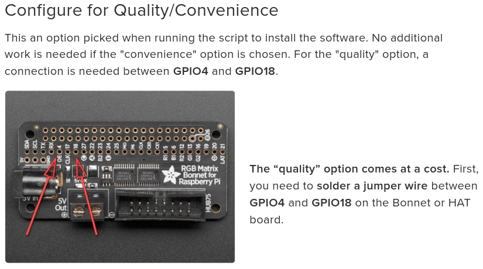

# football-led-scoreboard


Small project I made to utilize an LED matrix panel that was gathering dust.
It displays upcoming schedules, live scores with immediate updates, match results, and league table standings.

## Requirements
### Hardware

- Raspberry Pi (Zero W, 3B+, 4, or 5)
- RGB LED matrix panel 64x32
- [Adafruit RGB Matrix Bonnet](https://www.adafruit.com/product/3211)

> [!NOTE]
> I made a small adjustment to the bonnet to make use of the "quality" option by soldering GPIO 4 and 18.
> This way I was able to remove flickering which was very annoying.



### Installation

```bash
git clone https://github.com/imrein/football-led-scoreboard.git
cd football-led-scoreboard
sudo chmod +x install.sh
sudo ./install.sh
```

## Usage
### Manual run

You can run the scoreboard manually to check different leagues or dates:
```bash
# Default (Belgian League, Today's Date)
sudo python3 src/main.py

# Specific League (e.g., English Premier League)
sudo python3 src/main.py -l eng

# Specific Date (Format: MMDD)
sudo python3 src/main.py -l esp -d 1025
```

> [!NOTE]
> By default the application will check the current day. In case no matches are scheduled, it will check the next day.
> It will check up to 5 days in the future before exiting.

## Configuration

You can tweak display settings, colors, and timing in `src/config.py`:
```python
# How long each score is shown (default: 10s)
DISPLAY_MATCH_DURATION = 10

# 0-100 brightness level (default: 70)
MATRIX_BRIGHTNESS = 70

# Increase this (2, 3, 4) if your panel flickers or shows artifacts.
MATRIX_GPIO_SLOWDOWN = 2
```

## Supported leagues
### Current

| Abbreviation | League |
| :----------- | :----- |
| `bel`        | Pro League |
| `eng`        | Premier League |
| `esp`        | La Liga |
| `ger`        | Bundesliga |
| `ita`        | Serie A |
| `fra`        | Ligue 1 |
| `ned`        | Eredivisie |

### Extra leagues
There is a script included to gather other league logos:
```bash
python scripts/get_logos.py --league por
```

### Logos

The current available leagues can be found in `assets/logos/`. I included a small script to gather other leagues if these should be needed (`scripts/get_logos.py`)

## Credits
### API
The API that was used in this project is free and provided by [ESPN](https://www.espn.com/).

### Inspiration
Most of the inspiration for this project was gathered from other led matrix projects out there for other sports:

- https://github.com/riffnshred/nhl-led-scoreboard
- https://github.com/MLB-LED-Scoreboard/mlb-led-scoreboard
- https://github.com/mikemountain/nfl-led-scoreboard
- ...